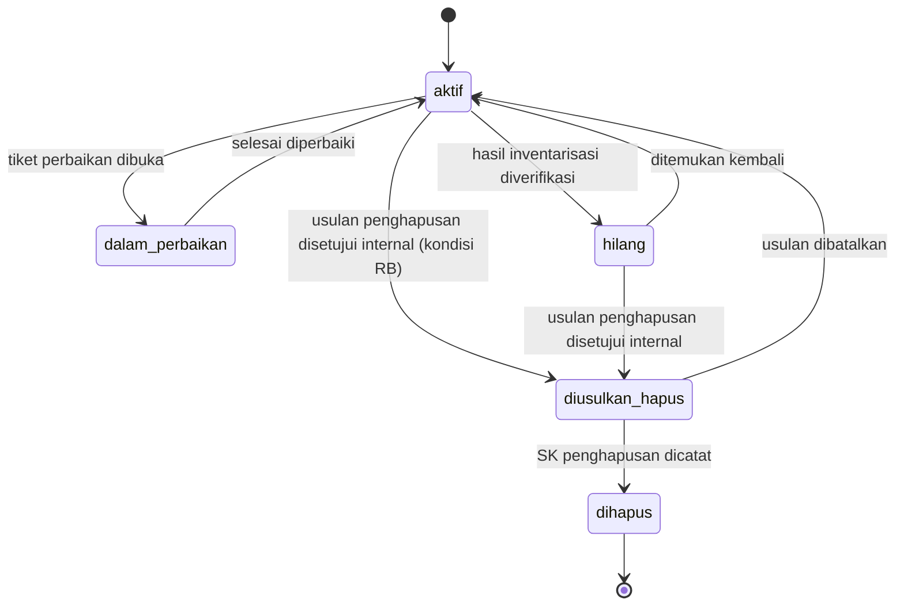
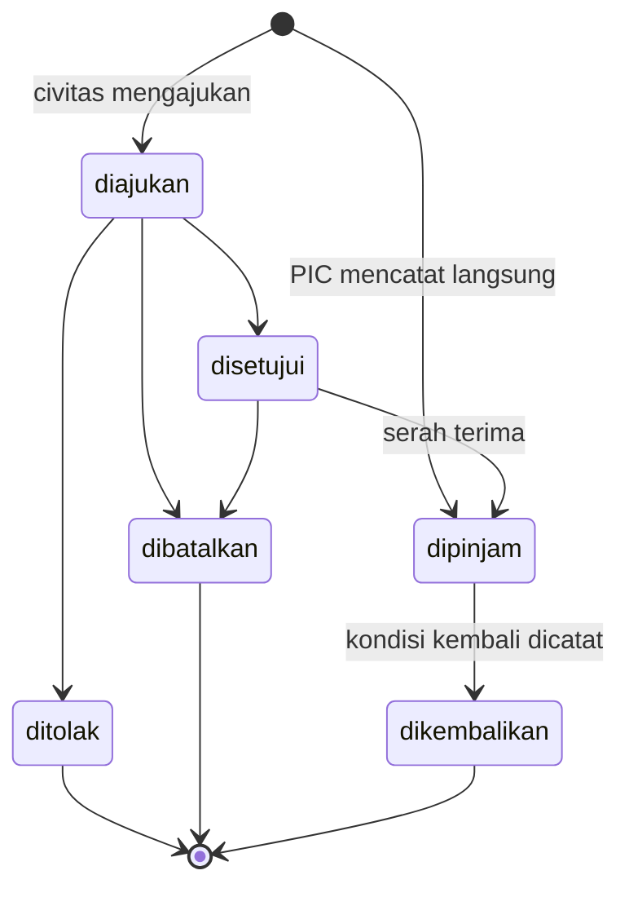
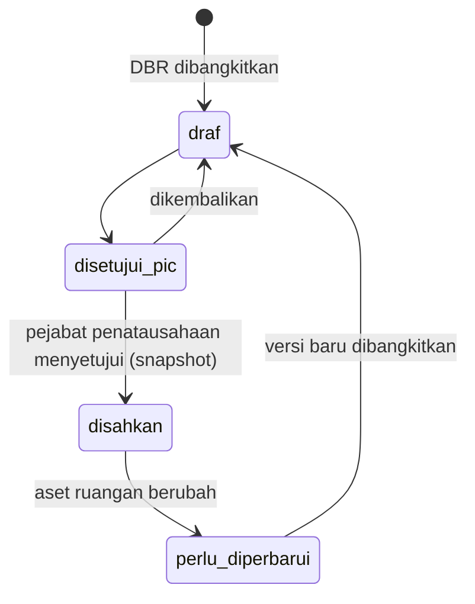

# 01 — PRD: ASET FKIP 3 (Sistem Aset/BMN dan Peminjaman)

> Pembangunan ulang SIMAN-FKIP-2 (Vue + Google Apps Script + Google Sheets) menjadi Laravel 13 + MySQL 8.4 + Redis 7.
> Baca dulu `00-ANALISIS-SISTEM-BERJALAN.md` (apa yang dipertahankan & diperbaiki) dan `06-REKOMENDASI-REGULASI.md` (tambahan berdasarkan aturan). Butir **(perlu verifikasi)** wajib dipastikan sebelum fase terkait.

## 1. Latar belakang

SIMAN-FKIP-2 sudah dipakai untuk inventaris per ruangan, label QR, mutasi, dan peminjaman harian. Logika bisnisnya tepat, tetapi fondasinya berisiko (otorisasi hanya di klien, data aset dapat dibaca publik lewat URL GAS, satu baris mewakili banyak unit, tanpa transaksi) dan belum memenuhi kebutuhan penatausahaan BMN (DBR, inventarisasi, daftar rusak berat/hilang, nilai perolehan). Sistem baru mempertahankan alur yang sudah dikenal pengguna, memindahkan data dari Google Sheets tanpa kehilangan riwayat, dan **menjaga label QR yang sudah tertempel tetap berfungsi**.

## 2. Dasar regulasi

| Dokumen | Pokok yang dipakai |
|---|---|
| PP No. 28 Tahun 2020 (perubahan PP 27/2014) tentang Pengelolaan BMN/D | Siklus pengelolaan: penggunaan, pemanfaatan, pengamanan & pemeliharaan, penghapusan (Pasal 81 ✔), penatausahaan; pinjam pakai antarinstansi pemerintah (Pasal 30 ✔) |
| PMK No. 181/PMK.06/2016 tentang Penatausahaan BMN | Pembukuan (Buku Barang, KIB, DBR, DBL ✔), inventarisasi ≥ 1 kali/5 tahun (Pasal 19 ✔) dan label registrasi ✔, kondisi B/RR/RB ✔, daftar barang rusak berat & hilang ✔, pelaporan semesteran/tahunan ✔ |
| LAMDIK IAPSK 3.0 (Peraturan LAMDIK 5/2025) | DKPS Tabel Sarana Laboratorium dan Pembelajaran, Prasarana Pendidikan, TIK; elemen K5 sarana-prasarana & K3L ✔ |
| UU No. 27 Tahun 2022 (PDP) | Data peminjam/pelapor = data pribadi (pasal **perlu verifikasi**) |

Rincian rekomendasi: `06-REKOMENDASI-REGULASI.md` (RG-01 s.d. RG-13).

## 3. Peran dan hak akses

| Peran | Pemegang | Ringkasan |
|---|---|---|
| `super-admin` | TI fakultas | Semua, termasuk pengguna, pengaturan, Horizon |
| `admin-bmn` | Operator BMN / Subbag Umum fakultas | Semua aset & master, setujui mutasi, kelola inventarisasi, usulan penghapusan, laporan & ekspor |
| `pejabat-penatausahaan` | Kasubag Umum / pejabat yang ditunjuk (**perlu verifikasi** struktur) | Menandatangani DBR & berita acara inventarisasi (persetujuan di sistem), menyetujui usulan penghapusan internal, memutuskan permohonan pihak luar |
| `pic-ruangan` | Laboran, staf, dosen penanggung jawab ruang | Aset di ruangan yang ditugaskan: ubah kondisi, catat peminjaman keluar/masuk, ajukan mutasi, proses permohonan peminjaman ruangannya, inventarisasi ruangannya, cetak label |
| `pimpinan` | Dekan, Wakil Dekan | Lihat seluruh data & dasbor, ekspor laporan (tanpa data pribadi peminjam) |
| `civitas` | Dosen, tendik, pengurus ormawa (akun surel unsil) | Katalog barang/ruang yang dapat dipinjam, ajukan peminjaman, lapor kerusakan, lihat riwayat pinjaman sendiri |
| publik | Tanpa login | Lookup label QR terbatas; lapor kerusakan dari halaman QR (rate limit) |

### 3.1 Matriks hak akses

Keterangan: **S** semua; **R** ruangan yang ditugaskan; **M** milik sendiri; **—** tidak.

| Modul / aksi | super-admin | admin-bmn | pejabat-penatausahaan | pic-ruangan | pimpinan | civitas | publik |
|---|---|---|---|---|---|---|---|
| Master (gedung, ruangan, kodefikasi, kategori) — kelola | S | S | — | — | — | — | — |
| Ruangan — lihat | S | S | S | S | S | katalog | — |
| Aset — lihat | S | S | S | S | S | katalog dapat dipinjam | lookup QR terbatas |
| Aset — tambah/ubah data induk | S | S | — | — | — | — | — |
| Aset — ubah kondisi | S | S | — | R | — | — | — |
| Aset — impor Excel | S | S | — | — | — | — | — |
| Label QR — cetak | S | S | — | R | — | — | — |
| Mutasi lokasi — ajukan | S | S | — | R (asal) | — | — | — |
| Mutasi lokasi — setujui | S | S | — | — | — | — | — |
| Peminjaman — catat langsung (keluar/masuk) | S | S | — | R | — | — | — |
| Peminjaman — ajukan online | — | — | — | — | — | M | — |
| Peminjaman — setujui/tolak pengajuan | S | S | pihak luar | R | — | — | — |
| Laporan kerusakan — buat | S | S | S | S | S | S | via QR |
| Pemeliharaan — kelola tiket | S | S | — | R | — | — | — |
| DBR — bangkitkan & ajukan tanda tangan | S | S | — | R | — | — | — |
| DBR — setujui (tanda tangan) | — | — | S | R (sebagai PIC) | — | — | — |
| Inventarisasi — kelola periode | S | S | — | — | — | — | — |
| Inventarisasi — pindai ruangan | S | S | — | R | — | — | — |
| Inventarisasi — setujui berita acara | — | — | S | — | — | — | — |
| Usulan penghapusan — buat | S | S | — | — | — | — | — |
| Usulan penghapusan — setujui internal | — | — | S | — | — | — | — |
| Laporan & ekspor | S | S | S | R | S (tanpa data pribadi) | — | — |
| Data pribadi peminjam/pelapor | S | S | S | R | — | M | — |
| Pengguna & peran | S | penugasan PIC | — | — | — | — | — |
| Pengaturan sistem, Horizon | S | — | — | — | — | — | — |

## 4. Modul dan kode cakupan commit

| Cakupan | Modul |
|---|---|
| `auth`, `peran`, `audit` | Login, peran, jejak audit |
| `master` | Gedung, ruangan, kategori ruangan, kodefikasi barang, sumber perolehan, unit/prodi |
| `aset` | Register aset per kode+NUP, kondisi, status, tautan foto/dokumen |
| `label` | QR & cetak label, resolusi label lama |
| `mutasi` | Mutasi lokasi antar ruangan |
| `peminjaman` | Peminjaman internal (catat langsung & pengajuan online), keranjang, keterlambatan |
| `pemeliharaan` | Laporan kerusakan & tiket perbaikan |
| `dbr` | DBR/DBL per ruangan, versi bertanda tangan |
| `inventarisasi` | Periode sensus/opname, pemindaian, berita acara |
| `penghapusan` | Daftar RB/hilang, usulan penghapusan |
| `publik` | Lookup QR & lapor kerusakan publik |
| `laporan` | Dasbor, laporan, ekspor rekonsiliasi & DKPS |
| `migrasi` | Impor data dari Google Sheets SIMAN-FKIP-2 |
| `berkas` | Tautan berkas (STANDAR-TEKNIS §1a) |
| `notifikasi`, `penjadwal`, `pengaturan`, `api` | Pendukung |

## 5. User story utama

- **US-AST-01** Sebagai admin-bmn, saya ingin mendaftarkan barang per **kode barang + NUP** dengan ruangan, kondisi, nilai & tanggal perolehan, agar sesuai penatausahaan BMN. *Given* kode 3100102001 NUP 15 sudah ada, *When* menyimpan NUP 15 lagi, *Then* ditolak.
- **US-AST-02** Sebagai admin-bmn, saya ingin mendaftarkan 20 unit kursi sekaligus (NUP 1–20) agar cepat, namun tiap unit tetap baris sendiri.
- **US-AST-03** Sebagai PIC ruangan, saya ingin mengubah kondisi barang di ruangan saya dan melihat riwayatnya. *Given* PIC Lab Komputer, *When* mengubah kondisi barang di Aula, *Then* 403.
- **US-LBL-01** Sebagai pengunjung, saya ingin memindai label **lama** (`KATEGORI-935464-2`) maupun label baru dan tetap melihat data barang yang benar.
- **US-MUT-01** Sebagai PIC, saya ingin mengajukan pemindahan satu atau beberapa barang ke ruangan lain; setelah admin menyetujui, lokasi berubah dan DBR kedua ruangan ditandai perlu diperbarui.
- **US-PJM-01** Sebagai PIC, saya ingin mencatat peminjaman beberapa barang sekaligus (keranjang) untuk satu peminjam dengan rencana kembali; barang yang sedang dipinjam/dalam perbaikan tidak bisa dipilih.
- **US-PJM-02** Sebagai civitas, saya ingin mengajukan peminjaman proyektor untuk tanggal tertentu dan diberi tahu saat disetujui. *Given* proyektor sudah dipesan pada rentang yang tumpang tindih, *When* mengajukan, *Then* ditolak "tidak tersedia".
- **US-PJM-03** Sebagai PIC, saya ingin daftar pinjaman terlambat dan mengirim pengingat ke peminjam.
- **US-PML-01** Sebagai mahasiswa, saya ingin memindai QR kursi rusak dan melaporkannya tanpa login; PIC menerima tiket.
- **US-DBR-01** Sebagai PIC, saya ingin membangkitkan DBR ruangan saya, menyetujuinya, lalu pejabat penatausahaan menyetujui; versi yang disetujui tersimpan sebagai snapshot dan PDF-nya dapat dicetak kapan pun.
- **US-INV-01** Sebagai admin-bmn, saya ingin membuka periode inventarisasi, menugaskan tim per ruangan, dan melihat progres pemindaian; barang yang tidak terpindai muncul sebagai "tidak ditemukan".
- **US-HPS-01** Sebagai admin-bmn, saya ingin menyusun usulan penghapusan dari daftar barang rusak berat dan mencatat nomor SK penghapusan setelah terbit.
- **US-LAP-01** Sebagai pimpinan, saya ingin dasbor jumlah & nilai aset per ruangan/kategori/kondisi dan ekspor DKPS sarana-prasarana per prodi.
- **US-MIG-01** Sebagai admin-bmn, saya ingin mengimpor data SIMAN-FKIP-2 (Google Sheets) sehingga barang, mutasi, peminjaman, dan log lama tersedia di sistem baru.

## 6. Aturan bisnis

| Kode | Aturan |
|---|---|
| BR-01 | Satu baris `aset` = satu barang fisik. Kombinasi `kode_barang` + `nup` unik untuk barang BMN (`status_bmn = tercatat`). Barang yang belum tercatat di aplikasi resmi boleh tanpa NUP (`status_bmn = belum_tercatat`) tetapi wajib `kode_internal` unik. |
| BR-02 | Setiap aset wajib berada di tepat satu `ruangan_id` atau ditandai `lokasi_lainnya` (masuk DBL). |
| BR-03 | Kondisi ∈ {B, RR, RB}. Setiap perubahan kondisi menulis `riwayat_kondisi_aset` (dari, ke, sumber, oleh, catatan). |
| BR-04 | Status aset: `aktif`, `dalam_perbaikan`, `diusulkan_hapus`, `hilang`, `dihapus`. Status `dipinjam` **tidak disimpan**, dihitung dari peminjaman aktif. Aset `dihapus` tidak pernah dihapus permanen dan wajib nomor & tanggal SK penghapusan. |
| BR-05 | PIC hanya dapat mengubah kondisi, mencatat peminjaman, mengajukan mutasi, dan memindai inventarisasi untuk aset di ruangan yang ditugaskan kepadanya (`ruangan_pic`). |
| BR-06 | Mutasi lokasi: pengajuan (satu/lebih aset dari satu ruangan asal ke satu ruangan tujuan, alasan wajib) → `disetujui`/`ditolak` oleh admin-bmn. Saat disetujui, dalam satu transaksi: `aset.ruangan_id` berubah, riwayat lokasi tercatat, DBR ruangan asal & tujuan ditandai `perlu_diperbarui`. Aset yang sedang dipinjam/dalam perbaikan tidak dapat dimutasi. |
| BR-07 | Peminjaman internal hanya untuk civitas (akun surel unsil) atau dicatat PIC atas nama peminjam internal. Permohonan pihak luar tidak diproses sebagai peminjaman; ditandai `pihak_luar` dan diteruskan ke pejabat-penatausahaan (skema pemanfaatan/sewa **perlu verifikasi**). |
| BR-08 | Satu aset tidak boleh memiliki dua peminjaman aktif/tersetujui yang rentang waktunya tumpang tindih. Ditegakkan dalam transaksi dengan `lockForUpdate` pada baris aset + `Cache::lock("aset:pinjam:{aset_id}")`. Keranjang bersifat semua-atau-tidak-sama-sekali. |
| BR-09 | Alur peminjaman: `diajukan` → `disetujui`/`ditolak` (PIC ruangan asal atau admin) → `dipinjam` (serah terima dicatat) → `dikembalikan` (kondisi saat kembali wajib) ; `dibatalkan` sebelum dipinjam. Catat langsung oleh PIC langsung berstatus `dipinjam`. Terlambat = `dipinjam` dan `rencana_kembali` < sekarang (dihitung, bukan status). |
| BR-10 | Kondisi saat kembali berbeda dari kondisi saat pinjam → kondisi aset diperbarui (BR-03, sumber `peminjaman`) dan, bila RR/RB, tiket pemeliharaan dibuat otomatis. |
| BR-11 | Aset `dalam_perbaikan`, `diusulkan_hapus`, `hilang`, `dihapus`, atau kondisi RB tidak dapat dipinjam. |
| BR-12 | Laporan kerusakan publik (tanpa login): rate limit 5/jam per IP, honeypot; nama & kontak opsional; IP tidak disimpan mentah (hash). Laporan membuat tiket `baru` ke PIC ruangan. |
| BR-13 | DBR dibangkitkan dari data aset ruangan saat itu; persetujuan PIC lalu pejabat-penatausahaan menyimpan **snapshot JSON** (daftar aset, kondisi, penandatangan, waktu) di `dbr_versi`. PDF selalu dirender dari snapshot (tidak disimpan sebagai berkas). Perubahan aset di ruangan setelah versi disetujui menandai `perlu_diperbarui`. |
| BR-14 | Inventarisasi: hanya satu periode `berjalan` dalam satu waktu; selama periode berjalan, mutasi pada ruangan yang sedang diinventarisasi ditahan (peringatan) — mengikuti toggle fitur lama. Hasil per aset: `ditemukan`, `tidak_ditemukan`, `kondisi_berubah`; barang fisik tanpa data dicatat sebagai `berlebih` (temuan). Penutupan periode menghasilkan berita acara (snapshot) yang disetujui pejabat-penatausahaan; aset `tidak_ditemukan` diusulkan berstatus `hilang` setelah verifikasi admin. |
| BR-15 | Pengingat inventarisasi: bila inventarisasi terakhir yang disetujui > 4 tahun (ambang dapat diatur; batas aturan 5 tahun, PMK 181/2016 Pasal 19), dasbor menampilkan peringatan. |
| BR-16 | Usulan penghapusan hanya berisi aset RB atau `hilang`; setelah keputusan internal disetujui, status aset `diusulkan_hapus`; setelah SK penghapusan dicatat, `dihapus`. |
| BR-17 | Label: QR berisi URL publik `/{domain}/a/{id}`. Label lama (`KATEGORI-KODE-UNIT`, `KODE-UNIT`, `KODE`, NUP, kode BMN) diresolusi lewat tabel `label_lama` hasil migrasi. `dicetak_pada` dicatat per aset. |
| BR-18 | Lookup publik hanya menampilkan: nama barang, merk/tipe, kategori, ruangan, kondisi, tahun perolehan, kode barang + NUP. Tidak menampilkan nilai, PIC, peminjam, atau riwayat. Rate limit 30/menit per IP. |
| BR-19 | Uang (`nilai_perolehan`, biaya pemeliharaan) `DECIMAL(15,2)`. |
| BR-20 | Berkas (foto barang, dokumen perolehan, SK penghapusan, berita acara bertanda tangan basah) berupa **tautan** di `tautan_berkas` (STANDAR-TEKNIS §1a). Foto lama di Drive (`lh3.googleusercontent.com/d/<id>`) dimigrasikan sebagai tautan. |
| BR-21 | Pelaku setiap aksi = pengguna terautentikasi (activitylog `causer`); tidak pernah diambil dari input. |
| BR-22 | Toggle fitur (tambah aset, hapus/usul hapus, ubah kondisi, mutasi, peminjaman) disimpan di `pengaturan` dan diperiksa di Action (bukan hanya di UI). |
| BR-23 | Data peminjam & pelapor hanya terlihat oleh PIC ruangan terkait, admin-bmn, pejabat-penatausahaan, super-admin, dan pemiliknya sendiri. Riwayat peminjaman dipangkas/anonimkan setelah `retensi_peminjaman_bulan` (bawaan 36, **perlu verifikasi**). |

## 7. Diagram status

## 8. Kebutuhan non-fungsional

| Aspek | Kebutuhan |
|---|---|
| Keamanan | Semua aksi diotorisasi di server (Policy); semua data di balik login kecuali lookup QR terbatas; MFA untuk super-admin & admin-bmn; rate limit login, lookup, lapor; UUID di URL |
| Kinerja | Daftar aset ≥ 10.000 baris dengan filter < 2 detik (indeks ruangan, kategori, kondisi, status); pemindaian QR → hasil < 1 detik |
| Konkurensi | Peminjaman & mutasi transaksional (BR-08) |
| Ponsel | Pemindaian QR, peminjaman, lapor kerusakan, dan inventarisasi nyaman di ponsel (kamera via `html5-qrcode`) |
| Audit | Activitylog semua model domain; riwayat kondisi, lokasi, status |
| Cadangan | Backup harian MySQL ≥ 30 hari; uji pulih per semester |
| Bahasa | Indonesia; tanggal `d F Y` |

## 9. Laporan & ekspor

| Kode | Laporan | Format |
|---|---|---|
| LAP-01 | DBR/DBL per ruangan (versi disahkan) | PDF (stream dari snapshot) |
| LAP-02 | Rekap aset per ruangan/kategori/kondisi (jumlah & nilai) | Dasbor + Excel |
| LAP-03 | Daftar barang rusak berat & daftar barang hilang | Excel/PDF |
| LAP-04 | Riwayat & statistik peminjaman, pinjaman terlambat | Excel |
| LAP-05 | Laporan & berita acara hasil inventarisasi | PDF (snapshot) + Excel selisih |
| LAP-06 | Ekspor rekonsiliasi semesteran (kode+NUP, lokasi, kondisi, nilai) untuk dicocokkan dengan aplikasi resmi | Excel |
| LAP-07 | DKPS LAMDIK: sarana laboratorium & pembelajaran, prasarana, TIK per prodi | Excel |
| LAP-08 | Rekap pemeliharaan (tiket, waktu selesai, biaya) | Excel |
| LAP-09 | Log aktivitas | Tampilan + Excel |

## 10. Di luar cakupan & keterkaitan

- Penyusutan/nilai buku, laporan resmi UAKPB, pemindahtanganan (aplikasi resmi Kemenkeu).
- Persediaan/barang habis pakai.
- Pembayaran sewa oleh pihak luar (dicatat sebagai permohonan saja; skema **perlu verifikasi**).
- **Surat (OrmawaHub)**: master gedung & ruangan dimiliki sistem Aset; Surat membaca lewat API baca (`GET /api/v1/ruangan`, `GET /api/v1/ruangan/{kode}/jadwal`) — dibangun di fase API (F11).
- **Akreditasi**: LAP-07. **Regulasi**: tautan ke PP/PMK. **FKIP Edu**: hanya kesiapan SSO (STANDAR-TEKNIS §6).
