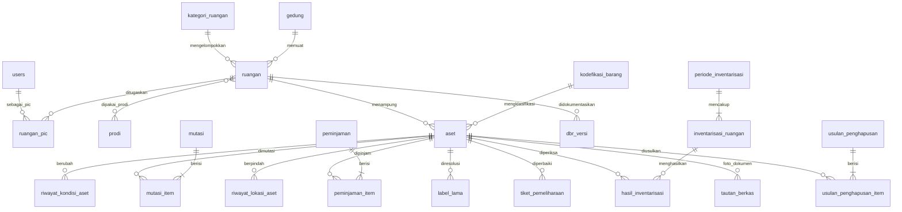

# 03 — Skema Database: ASET FKIP 3

MySQL 8.4, `utf8mb4_0900_ai_ci`, InnoDB. Semua tabel domain memiliki `id`, `created_at`, `updated_at`; semua primary key `id` **UUIDv7** CHAR(36) (`HasUuids`, STANDAR-TEKNIS §4a); FK `foreignUuid`, polimorfik `uuidMorphs`; URL, QR, dan API memakai `id` yang sama (tanpa kolom `ulid`).

## 1. ERD

## 2. Master

### `gedung`
| Kolom | Tipe | Keterangan |
|---|---|---|
| kode | VARCHAR(20) UNIQUE | mis. `GD-A` |
| nama | VARCHAR(150) | |
| alamat | VARCHAR(255) NULL | |
| deleted_at | TIMESTAMP NULL | soft delete |

### `kategori_ruangan`
`nama` VARCHAR(100) UNIQUE, `adalah_laboratorium` BOOL, `adalah_ruang_kelas` BOOL (untuk DKPS).

### `ruangan`
| Kolom | Tipe | Keterangan |
|---|---|---|
| kode | VARCHAR(30) UNIQUE | = `idRuangan` SIMAN-2 bila ada |
| nama | VARCHAR(150) | |
| gedung_id | FK NULL | |
| kategori_ruangan_id | FK NULL | |
| lantai | VARCHAR(10) NULL | |
| kapasitas | SMALLINT UNSIGNED NULL | |
| dapat_dipinjam | BOOL default false | Untuk katalog & API Surat |
| luas_m2 | DECIMAL(8,2) NULL | DKPS prasarana |
| k3l | JSON NULL | `{apar: true, p3k: true, jalur_evakuasi: true}` (RG-11) |
| keterangan | TEXT NULL | |
| deleted_at | TIMESTAMP NULL | |
Pivot `prodi_ruangan` (`prodi_id`, `ruangan_id`). Tabel `prodi` (kode, nama, `kode_eksternal`).

### `ruangan_pic`
`ruangan_id` FK, `user_id` FK, `utama` BOOL, UNIQUE(`ruangan_id`,`user_id`). Pengganti `users.ruangan` (JSON) & `ruangan.userIdPIC` SIMAN-2.

### `kodefikasi_barang`
| Kolom | Tipe | Keterangan |
|---|---|---|
| kode | VARCHAR(20) UNIQUE | Kode barang BMN (sub-sub kelompok), diimpor dari referensi resmi (**sumber perlu verifikasi**) |
| uraian | VARCHAR(255) | |
| tingkat | TINYINT | 1 golongan … 5 sub-sub kelompok |
| induk_kode | VARCHAR(20) NULL | |
| kategori_lokal | VARCHAR(100) NULL | Pemetaan ke kategori SIMAN-2 (`kategori.namaKategori`) |
FULLTEXT(`uraian`).

## 3. Aset

### `aset`
| Kolom | Tipe | Null | Keterangan |
|---|---|---|---|
| status_bmn | VARCHAR(20) | | `tercatat` / `belum_tercatat` (BR-01) |
| kode_barang | VARCHAR(20) | ya | FK logis ke `kodefikasi_barang.kode` |
| nup | INT UNSIGNED | ya | |
| kode_internal | VARCHAR(30) UNIQUE | ya | Wajib bila `belum_tercatat`; = `kodeBarang` SIMAN-2 untuk data lama |
| nama | VARCHAR(255) | | |
| merk_tipe | VARCHAR(255) | ya | |
| spesifikasi | TEXT | ya | |
| tahun_perolehan | SMALLINT | ya | |
| tanggal_perolehan | DATE | ya | |
| nilai_perolehan | DECIMAL(15,2) | ya | BR-19 |
| sumber_perolehan | VARCHAR(20) | ya | Enum `SumberPerolehan`: pembelian, hibah, transfer_masuk, lainnya |
| sumber_dana | VARCHAR(50) | ya | |
| nomor_dokumen_perolehan | VARCHAR(100) | ya | |
| penguasaan | VARCHAR(30) | | default `milik_sendiri` (SIMAN-2 `penguasaan`) |
| ruangan_id | FK | ya | null bila `lokasi_lainnya` diisi (DBL) |
| lokasi_lainnya | VARCHAR(150) | ya | BR-02 |
| kondisi | CHAR(2) | | `B`, `RR`, `RB` |
| status | VARCHAR(20) | | Enum `StatusAset` (BR-04) |
| dapat_dipinjam | BOOL | | default false |
| nomor_sk_penghapusan | VARCHAR(100) | ya | wajib bila `dihapus` |
| tanggal_sk_penghapusan | DATE | ya | |
| dicetak_pada | DATETIME | ya | label terakhir dicetak |
| label_perlu_cetak_ulang | BOOL | | default false; true untuk aset terdampak R-17 (07-MIGRASI §4a) |
| kelompok_pengadaan | VARCHAR(50) | ya | Penanda pendaftaran massal (US-AST-02) |
| keterangan | TEXT | ya | |
| deleted_at | TIMESTAMP | ya | hanya untuk salah input oleh super-admin |

Indeks: UNIQUE(`kode_barang`,`nup`) (NULL diabaikan MySQL), (`ruangan_id`,`status`,`kondisi`), (`status`), (`kode_barang`), FULLTEXT(`nama`,`merk_tipe`). CHECK: `kondisi IN ('B','RR','RB')`; `status_bmn <> 'tercatat' OR (kode_barang IS NOT NULL AND nup IS NOT NULL)`; `status <> 'dihapus' OR nomor_sk_penghapusan IS NOT NULL`.

### `riwayat_kondisi_aset`
`aset_id`, `dari` CHAR(2) NULL, `ke` CHAR(2), `sumber` (manual, peminjaman, inventarisasi, laporan_kerusakan, migrasi), `sumber_id` NULL, `catatan`, `oleh` FK NULL, `created_at`.

### `riwayat_lokasi_aset`
`aset_id`, `dari_ruangan_id` NULL, `ke_ruangan_id` NULL, `sumber` (mutasi, koreksi, migrasi), `mutasi_id` NULL, `oleh`, `created_at`.

### `riwayat_status_aset`
`aset_id`, `dari`, `ke`, `catatan`, `oleh`, `created_at`.

### `label_lama`
| Kolom | Tipe | Keterangan |
|---|---|---|
| teks | VARCHAR(100) | Teks QR/label lama ter-normalisasi uppercase, mis. `935464-2`, `ELEKTRONIK-935464-2`, `935464` |
| aset_id | FK | |
UNIQUE(`teks`). Diisi saat migrasi (07-MIGRASI-DATA §4).

## 4. Transaksi

### `mutasi` / `mutasi_item`
`mutasi`: `nomor` UNIQUE (`MUT-2026-0001`), `ruangan_asal_id`, `ruangan_tujuan_id`, `alasan`, `status` (diajukan, disetujui, ditolak, dibatalkan), `diajukan_oleh`, `diputuskan_oleh`, `diputuskan_pada`, `catatan_keputusan`. `mutasi_item`: `mutasi_id`, `aset_id`. Indeks (`status`,`created_at`).

### `peminjaman` / `peminjaman_item`
| Kolom (`peminjaman`) | Tipe | Keterangan |
|---|---|---|
| id, nomor | | `PJM-2026-00001` (pengganti `kodeTransaksi`) |
| jenis_peminjam | VARCHAR(20) | `civitas`, `pihak_luar` (BR-07) |
| peminjam_user_id | FK NULL | bila civitas berakun |
| nama_peminjam | VARCHAR(150) | |
| kontak_peminjam | VARCHAR(50) NULL | data pribadi (BR-23) |
| unit_peminjam | VARCHAR(150) NULL | prodi/ormawa |
| keperluan | TEXT | |
| mulai | DATETIME | |
| rencana_kembali | DATETIME | |
| status | VARCHAR(20) | Enum `StatusPeminjaman` (BR-09) |
| diputuskan_oleh / diputuskan_pada / catatan_keputusan | | |
| diserahkan_oleh / diserahkan_pada | | |
| diterima_kembali_oleh / dikembalikan_pada | | |
| dicatat_oleh | FK | |

`peminjaman_item`: `peminjaman_id`, `aset_id`, `kondisi_saat_pinjam` CHAR(2), `kondisi_saat_kembali` CHAR(2) NULL, `catatan`. Indeks untuk cek bentrok: `peminjaman_item(aset_id)` + `peminjaman(status, mulai, rencana_kembali)`.

### `tiket_pemeliharaan`
`nomor` (`TKT-2026-0001`), `aset_id`, `sumber` (publik, civitas, pic, peminjaman, inventarisasi), `deskripsi`, `nama_pelapor` NULL, `kontak_pelapor` NULL, `ip_hash` CHAR(64) NULL, `status` (baru, diproses, menunggu_suku_cadang, selesai, tidak_dapat_diperbaiki), `tindakan`, `biaya` DECIMAL(15,2) NULL, `ditangani_oleh`, `selesai_pada`.

## 5. DBR, inventarisasi, penghapusan

### `dbr_versi`
`ruangan_id` NULL, `jenis` (`dbr`, `dbl`), `versi` INT, `status` (draf, disetujui_pic, disahkan, perlu_diperbarui), `snapshot` JSON (daftar aset: kode_barang, nup, nama, merk, tahun, kondisi; penandatangan; waktu), `disetujui_pic_oleh/pada`, `disahkan_oleh/pada`. UNIQUE(`ruangan_id`,`jenis`,`versi`).

### `periode_inventarisasi`
`nama` ("Inventarisasi 2026"), `jenis` (`sensus`, `opname_internal`), `mulai`, `selesai_rencana`, `status` (rencana, berjalan, ditutup, disahkan), `berita_acara` JSON snapshot, `disahkan_oleh/pada`. Satu `berjalan` (BR-14) ditegakkan di Action + lock.

### `inventarisasi_ruangan`
`periode_id`, `ruangan_id`, `petugas_id` (FK users, multi via pivot `inventarisasi_petugas` bila perlu), `status` (belum, berjalan, selesai), `selesai_pada`. UNIQUE(`periode_id`,`ruangan_id`).

### `hasil_inventarisasi`
`inventarisasi_ruangan_id`, `aset_id` NULL (null untuk temuan berlebih), `hasil` (`ditemukan`, `tidak_ditemukan`, `kondisi_berubah`, `berlebih`), `kondisi_ditemukan` CHAR(2) NULL, `deskripsi_temuan` NULL, `dipindai_oleh`, `dipindai_pada`. UNIQUE(`inventarisasi_ruangan_id`,`aset_id`).

### `usulan_penghapusan` / `usulan_penghapusan_item`
`nomor`, `alasan`, `status` (draf, diajukan, disetujui_internal, sk_terbit, dibatalkan), `nomor_sk`, `tanggal_sk`, pengusul/pemutus. Item: `aset_id`, `alasan_item` (rusak_berat, hilang).

### `pemakaian_ruangan` (F11, integrasi Surat)
`ruangan_id`, `mulai` DATETIME, `selesai` DATETIME, `kegiatan` VARCHAR(255), `sumber` (`surat`, `manual`), `referensi_eksternal` VARCHAR(100) (nomor permohonan di Surat), `status` (`terjadwal`, `dibatalkan`), `dicatat_oleh` (user atau klien API). Indeks (`ruangan_id`,`mulai`,`selesai`); cek bentrok di Action dengan `lockForUpdate` pada baris ruangan.

## 6. Pendukung

- `tautan_berkas` — persis STANDAR-TEKNIS §1a (polimorfik: `Aset`, `Ruangan`, `UsulanPenghapusan`, `PeriodeInventarisasi`, `TiketPemeliharaan`).
- `pengaturan` — kunci/nilai: identitas instansi (instansi_baris1/2, nama_kampus, alamat, kontak, kota_surat — dari `config` SIMAN-2), penandatangan (nama/NIP kasubag & penanggung jawab), toggle fitur (BR-22), `ambang_pengingat_inventarisasi_tahun` (4), `retensi_peminjaman_bulan` (36), `maks_hari_pinjam` (14).
- `impor_siman2_log` — jejak migrasi per baris sumber (sheet, id lama, id baru, status, pesan).
- Tabel paket: `users` (+ `nip`, `no_hp`, `aktif`), `roles/permissions`, `activity_log`, `notifications`, `personal_access_tokens`, `imports/exports` — semuanya disesuaikan ke UUID (STANDAR-TEKNIS §4a); `jobs`, `failed_jobs`, `cache` tetap bawaan.

## 7. Enum

| Enum | Nilai |
|---|---|
| `KondisiAset` | `B` Baik · `RR` Rusak Ringan · `RB` Rusak Berat |
| `StatusAset` | `aktif` · `dalam_perbaikan` · `diusulkan_hapus` · `hilang` · `dihapus` |
| `StatusBmn` | `tercatat` · `belum_tercatat` |
| `StatusPeminjaman` | `diajukan` · `disetujui` · `ditolak` · `dibatalkan` · `dipinjam` · `dikembalikan` |
| `StatusMutasi` | `diajukan` · `disetujui` · `ditolak` · `dibatalkan` |
| `StatusTiket` | `baru` · `diproses` · `menunggu_suku_cadang` · `selesai` · `tidak_dapat_diperbaiki` |
| `StatusDbr` | `draf` · `disetujui_pic` · `disahkan` · `perlu_diperbarui` |
| `HasilInventarisasi` | `ditemukan` · `tidak_ditemukan` · `kondisi_berubah` · `berlebih` |

## 8. Seeder

- `PeranDanIzinSeeder`: peran PRD §3 + permission per modul (`aset.lihat`, `aset.kelola`, `aset.ubah-kondisi`, `label.cetak`, `mutasi.ajukan`, `mutasi.putuskan`, `peminjaman.catat`, `peminjaman.ajukan`, `peminjaman.putuskan`, `pemeliharaan.kelola`, `dbr.bangkitkan`, `dbr.sahkan`, `inventarisasi.kelola`, `inventarisasi.pindai`, `inventarisasi.sahkan`, `penghapusan.kelola`, `penghapusan.putuskan`, `laporan.lihat`, `laporan.ekspor`, `data-pribadi.lihat`, `master.kelola`, `pengguna.kelola`, `pengaturan.kelola`).
- `PengaturanSeeder`: identitas dari `config` SIMAN-2 (Kementerian…, Universitas Siliwangi, FKIP, Jl. Siliwangi No. 24 Tasikmalaya, kota Tasikmalaya) — nama kementerian di kop **perlu verifikasi** (SIMAN-2 menulis "KEMENTRIAN PENDIDIKAN TINGGI").
- `KategoriRuanganSeeder`, `ProdiSeeder` (CSV contoh), `KodefikasiBarangSeeder` (CSV referensi — sediakan contoh beberapa baris, isi lengkap diimpor admin).
